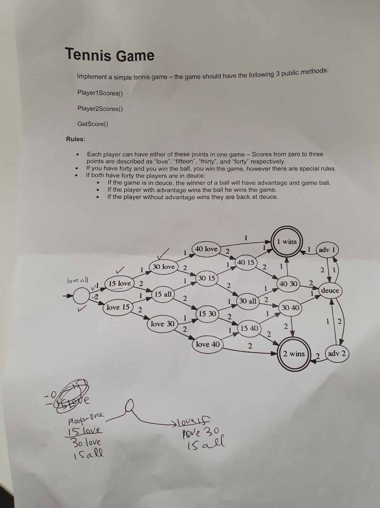

- [Tennis Game Kata (JavaScript - TDD)](#tennis-game-kata--javascript---tdd-)
  * [Instructions](#instructions)
  * [Rules](#rules)
  * [Future Development](#future-development)
    + [New Requirements](#new-requirements)
    + [Steps to achieve the above goal:](#steps-to-achieve-the-above-goal-)

<small><i><a href='http://ecotrust-canada.github.io/markdown-toc/'>Table of contents generated with markdown-toc</a></i></small>

# Tennis Game Kata (JavaScript - TDD)
This is a simple kata to solve the tennis game in JavaScript.

## Instructions
Please follow the following instructions to start the project.

1. In a terminal navigate to the root of the folder i.e. `*/tennis-game-kata` and run `yarn` to install the project dependencies locally
2. In the same folder now run `yarn test` to run all the tests 

Once you run all the tests. It will automatically rerun when there are changes made to any file. If you don't want this you can remove the `--watchAll` flag from the test script in the `package.json` file. More cli options for Jest can be found at https://jestjs.io/docs/cli.

## Rules
The diagram is mainly used in this kata to make it easy for understanding the game state.

## Future Development 
Read more on Tennis to understand the concept of sets and how a game is won. 

https://www.usta.com/en/home/improve/tips-and-instruction/national/tennis-scoring-rules.html
https://mytennishq.com/how-many-sets-are-played-in-tennis/

### New Requirements 
1. Add the concept of best-of-three sets format with 6 games (and a possible tiebreak) in each set.
2. Update the kata so that a player only wins the game when the at least 2 sets have been won 

### Steps to achieve the above goal:
1. Update the diagram to visualise the above requirements to make it easy for implementation
2. Use TDD to implement the above requirements